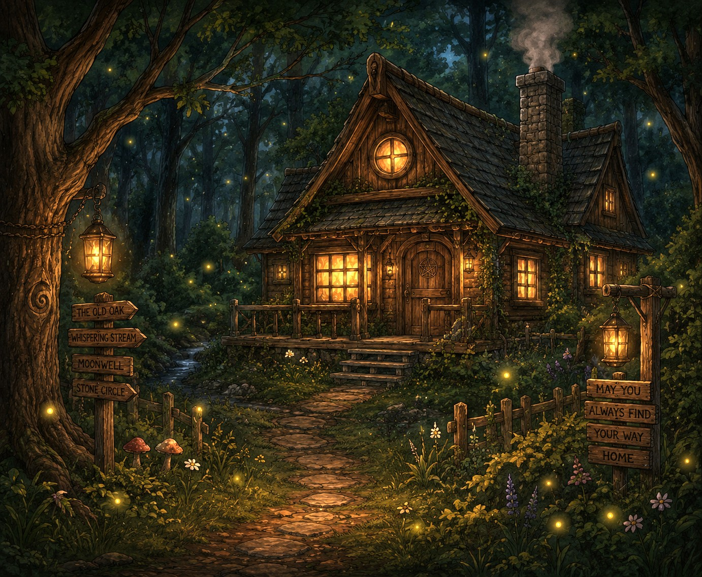
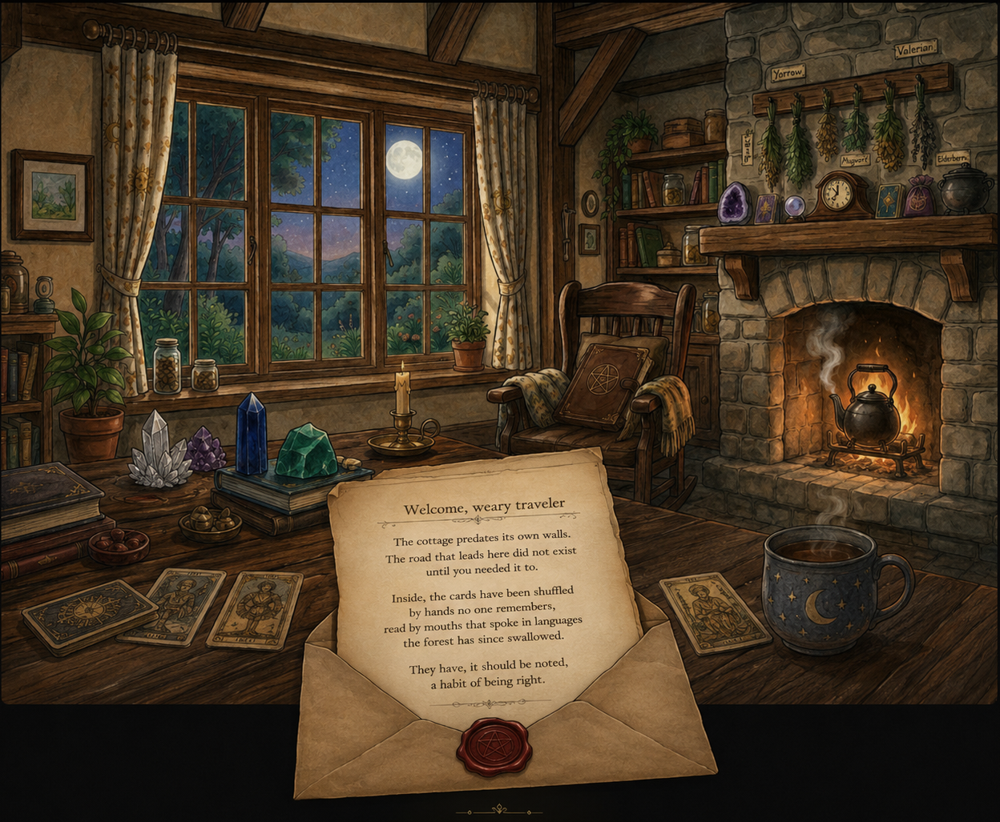

# Tarot Quest

Tarot Quest is a single-page, front-end web app for learning tarot cards one card at a time through guided lessons, quizzes, achievements, and progression tracking.

## How To Run

1. Clone or download this repository.
2. Open `tarot-quest.html` in any modern browser.
3. Start from the Home scene and use the in-app buttons to navigate.

No build step or backend server is required.

## Website Navigation Guide (With Images)

### 1) Home Scene

You begin on the home panel with a cottage visual.



- Click **Walk Into The Cottage** to trigger the cottage-to-letter transition.
- After the transition completes, click **Begin Your Tarot Quest**.

### 2) Letter Transition Scene

The transition reveals the letter panel before lesson flow begins.



- This is part of the guided entry sequence to the learning flow.
- Continue into the lesson phases from here.

### 3) Lesson + Quiz Flow

During a card lesson, move phase-by-phase using the **Continue** controls and then complete the quiz.

- Typical order includes reveal, numerology, color, figure, scene, symbols, reversed meaning, and quiz.
- On the quiz page, select answers and submit to generate results.

### 4) Seeker Accuracy (Results)

After quiz submission, the **Seeker Accuracy** page shows:

- Score and percentage.
- Question-by-question correctness.
- Gems earned and progression updates.
- Navigation buttons to review, return home, or move to the next card.

### 5) Treasure Room

Open the treasure/chest experience to view gem totals and progression highlights.


### 6) Alchemy Library (Achievements)

Check the Library to view achievement cards and unlock progress.


### 7) Return + Continue Learning

- Use in-app navigation to return to Home/Cottage.
- Start the next card to continue deck mastery.
- Progress is persisted in browser local storage.

## Folder Structure And File Responsibilities

```text
tarot-quest/
├─ tarot-quest.html
├─ deck-data.js
├─ README.md
├─ assets/
│  ├─ css/
│  │  └─ main.css
│  ├─ images/
│  │  ├─ Cottage.jpeg
│  │  ├─ Inside_Cottage.jpeg.png
│  │  ├─ letter.jpeg.png
│  │  ├─ Treasure_room.JPEG
│  │  ├─ achievement_first_five.jpeg
│  │  ├─ achievement_major_arcana.jpeg
│  │  ├─ achievement_master.jpg
│  │  ├─ achievement_pentacles.jpg
│  │  ├─ achievement_quiz.jpg
│  │  ├─ achievement_speed.jpg
│  │  ├─ achievement_swords.jpg
│  │  ├─ achievement_wands.jpeg
│  │  ├─ whimsical cottage.jpeg
│  │  └─ whimsical-cottage.jpeg
│  └─ js/
│     ├─ app.js
│     ├─ intro-sequence.js
│     └─ modules/
│        ├─ achievement-service.js
│        ├─ quiz-engine.js
│        ├─ state-manager.js
│        ├─ storage-service.js
│        └─ renderers/
│           ├─ chest-renderer.js
│           ├─ home-renderer.js
│           ├─ library-renderer.js
│           ├─ quiz-renderer.js
│           └─ results-renderer.js
```

## What Each File Does

### Root Files

- `tarot-quest.html`: Main HTML shell. Mount point and script/style includes for the app.
- `deck-data.js`: Tarot deck source data (cards, ordering, and metadata consumed by app logic).
- `README.md`: Project documentation and usage notes.

### Styles

- `assets/css/main.css`: All visual styling, layout, transitions, animation timings, and component state classes.

### Core App Scripts

- `assets/js/app.js`: Main runtime controller. Handles state transitions, rendering orchestration, navigation logic, progression, gems, and action wiring.
- `assets/js/intro-sequence.js`: Intro behavior handler. Legacy full-screen intro is programmatically disabled and hidden to prevent interaction conflicts.

### Service/Logic Modules

- `assets/js/modules/state-manager.js`: Creates and resets canonical application state (progress, settings, current view, review/session info).
- `assets/js/modules/storage-service.js`: Browser `localStorage` JSON read/write utility used for persistence.
- `assets/js/modules/quiz-engine.js`: Quiz correctness evaluation and completion checks.
- `assets/js/modules/achievement-service.js`: Achievement progress tracking, unlock checks, group completion logic, and gem rewards.

### Renderer Modules

- `assets/js/modules/renderers/home-renderer.js`: Home panel markup, cottage-to-letter transition visuals, and Home CTA buttons.
- `assets/js/modules/renderers/quiz-renderer.js`: Quiz screen markup, answer selection UI, and submit button state.
- `assets/js/modules/renderers/results-renderer.js`: Seeker Accuracy screen, question result breakdown, earned gems, and post-quiz actions.
- `assets/js/modules/renderers/library-renderer.js`: Alchemy Library achievement card grid and achievement visuals.
- `assets/js/modules/renderers/chest-renderer.js`: Treasure Room panel, gem visuals, progression summary, and gem interaction effects.

### Images

- `assets/images/`: Artwork and UI imagery used across Home, transition scenes, Treasure Room, and achievement cards.

## Maintenance Notes

- Keep tarot card content updates in `deck-data.js`.
- Keep UX/visual tweaks in `assets/css/main.css`.
- Keep behavior/state/routing changes in `assets/js/app.js` and `assets/js/modules/*`.
- Use renderer modules for markup changes to specific pages instead of editing unrelated app logic.
